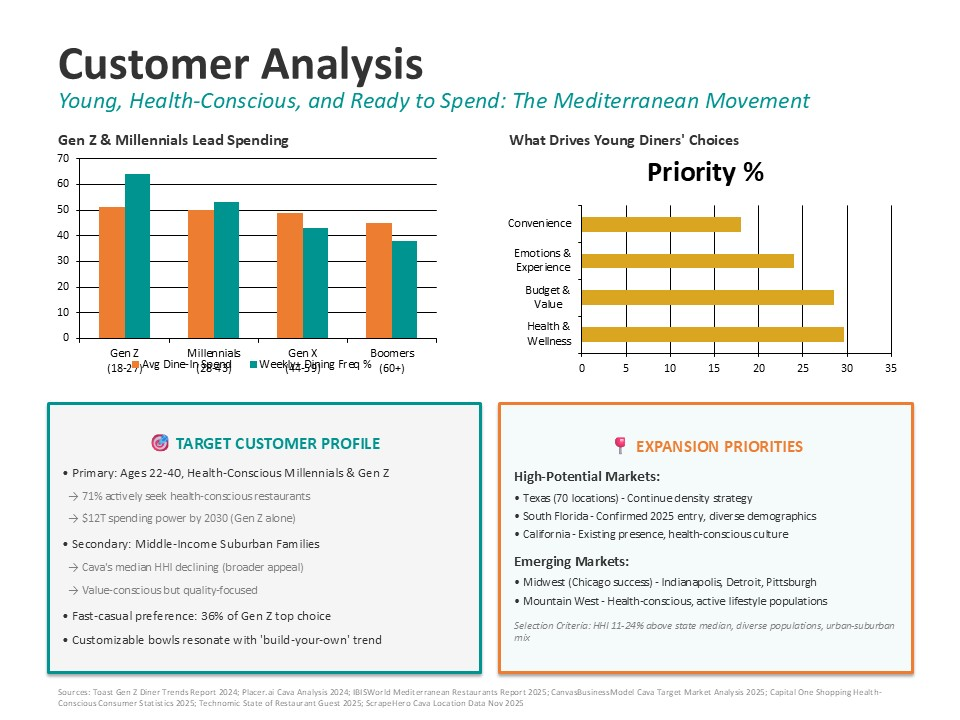
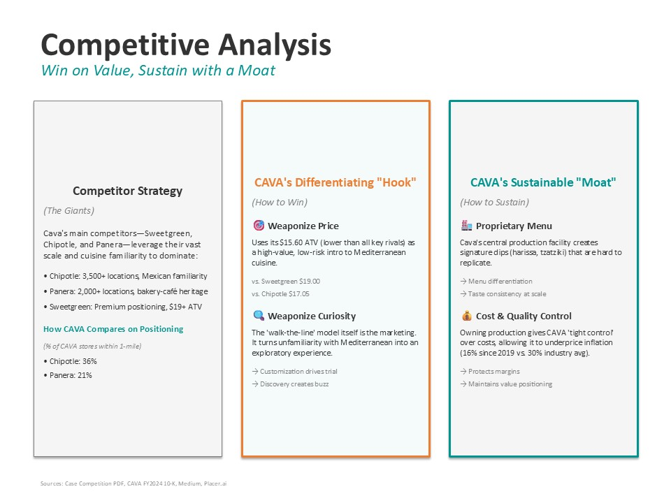
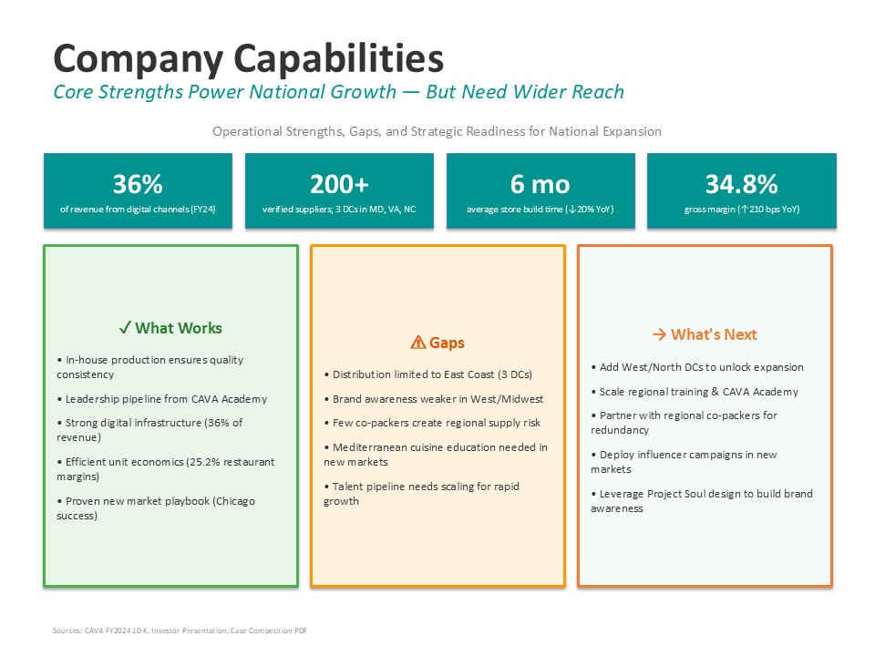

# CAVA Growth Strategy: Mediterranean Fast-Casual Expansion

## Executive Summary
**The Challenge:** CAVA, a fast-growing Mediterranean fast-casual chain, faces the "scale paradox": how to expand rapidly beyond its East Coast stronghold without sacrificing the operational quality and brand authenticity that made it successful.

**The Strategy:** We designed a **"Sustainable Moat"** strategy that leverages CAVA’s vertically integrated supply chain to maintain a pricing advantage while aggressively expanding into high-density markets like Texas and Florida.

**Key Impact:**
* Identified a **14% pricing advantage** ($15.60 vs. competitor avg $18+) as the primary lever for customer acquisition.
* Developed a market selection model targeting regions with **HHI 11-24% above state medians**.
* Recommended a "hub-and-spoke" expansion model centered around new Central Production Facilities (CPFs).

---

## Market Analysis & Opportunity
*Data Source: Management Consulted Case Prompt & Industry Reports (2025)*

The U.S. fast-casual sector is a **$45.6B market** growing at **6.4% CAGR**. Within this, CAVA is an outlier, delivering **59.8% YoY revenue growth** (2023) and consistently outperforming industry same-store sales benchmarks (13.4% vs. 3-5%).

| Metric | CAVA Performance | Industry Average |
| :--- | :--- | :--- |
| **Same-Store Sales** | +13.4% to +17.9% | +3% to +5% |
| **Price Increases** | 16% (Since 2019) | ~30% |
| **Geo Concentration** | 70% in 6 States | N/A |

**The Opportunity:** 70% of CAVA's footprint is locked in just 6 states. There is massive untapped potential in the "Smile States" (Sunbelt) where demographics skew young, wealthy, and health-conscious.

---

## Competitive Landscape: The "Sustainable Moat"

We analyzed CAVA against key competitors (Chipotle, Sweetgreen, Panera). While competitors rely on scale, CAVA wins on **Value & Customization**.

### 1. Weaponizing Price (The Hook)
CAVA acts as a "high-value, low-risk" option for consumers.
* **CAVA:** $15.60 ATV
* **Chipotle:** $17.05 ATV
* **Sweetgreen:** $19.00 ATV

### 2. Vertical Integration (The Shield)
Unlike competitors who rely heavily on co-packers, CAVA owns its production of proprietary dips (Crazy Feta, Hummus). This allows CAVA to:
* Control costs (underpricing inflation).
* Guarantee consistency across 300+ locations.
* Create a flavor profile that cannot be "cloned" by competitors.

---

## Strategic Recommendation

### Phase 1: Density Strategy (Years 1-2)
Focus expansion on **Texas and South Florida**.
* **Why?** High alignment with target demographic (Gen Z/Millennials, $93k+ Income).
* **Tactic:** Co-locate 79% of new stores within 1 mile of Chipotle to draft off established traffic patterns while offering a healthier, cheaper alternative.

### 2. Operational Scaling (Years 2-3)
Expand the **Central Production Facility (CPF)** network to the West Coast *before* aggressive store opening. This ensures supply chain resilience and protects margins from day one.

---

## Project Slides
*Below are selected slides from the strategic presentation.*

### Customer Analysis

### Competitive Analysis

### Company Capabilities

---

## 🛠 Tools & Skills Used
* **Market Sizing & Forecasting:** Analyzed industry CAGR and revenue projections.
* **Competitive Benchmarking:** Price elasticity and demographic overlap analysis.
* **Strategic Frameworks:** Utilized "Moats" and "Unit Economics" to justify expansion.
* **Data Visualization:** Excel & PowerPoint for storytelling.

---
*This project was completed as part of the Management Consulted Case Competition (Nov 2025).*
